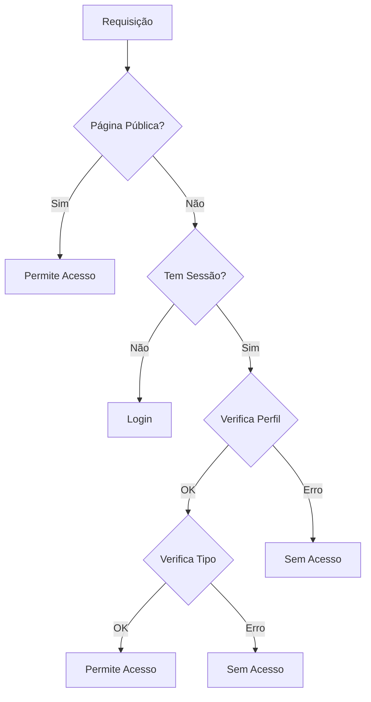

# Sistema de Autenticação e Perfis

## Visão Geral
O sistema utiliza Supabase para autenticação e gerenciamento de perfis. A autenticação é baseada em sessão e os perfis são gerenciados através de tabelas específicas no banco de dados.

## Tipos de Perfis

### Enumeração de Tipos
```typescript
const PERFIL_TIPOS = {
  PESSOA: 1,   // Perfil básico
  REVENDA: 2,  // Perfil de revenda
  ERP: 3,      // Perfil de ERP
  MASTER: 4    // Perfil administrativo
} as const
```

### Status de Revenda
```typescript
const REVENDA_STATUS = {
  PENDENTE: 1,  // Aguardando ativação
  ATIVO: 2,     // Revenda ativa
  SUSPENSO: 3   // Revenda suspensa
} as const
```

## Estrutura de Dados

### Tabela `perfis`
```sql
CREATE TABLE perfis (
  id UUID PRIMARY KEY,
  user_id UUID REFERENCES auth.users,
  tipo INTEGER NOT NULL,
  nome_completo TEXT,
  foto_url TEXT,
  dominio TEXT UNIQUE,
  apelido TEXT,
  revenda_status INTEGER,
  created_at TIMESTAMP WITH TIME ZONE DEFAULT NOW()
);
```

### Tabela `perfis_users`
```sql
CREATE TABLE perfis_users (
  id UUID PRIMARY KEY,
  perfil_id UUID REFERENCES perfis(id),
  user_id UUID REFERENCES auth.users(id),
  created_at TIMESTAMP WITH TIME ZONE DEFAULT NOW()
);
```

## Fluxo de Autenticação

### 1. Login Inicial
- Arquivo: `src/app/auth/login/page.tsx`
- O usuário insere email e senha
- Chamada ao Supabase para autenticação:
```typescript
const { error } = await supabase.auth.signInWithPassword({
  email,
  password,
})
```

### 2. Carregamento do Perfil
- Arquivo: `src/contexts/perfil.tsx`
- Após autenticação, o perfil é carregado baseado no user_id
- O perfil determina o tipo de acesso e as permissões

### 3. Redirecionamento
- Baseado no tipo do perfil:
  - REVENDA → `/revendas`
  - ERP → `/erp/dashboard`
  - MASTER → `/master`
  - Outros → `/auth/sem-acesso`

## Middleware de Proteção
- Arquivo: `src/middleware.ts`
- Protege rotas baseado no tipo de perfil
- Verifica permissões de acesso
- Redireciona usuários não autorizados

### Páginas Públicas
```typescript
const PUBLIC_PAGES = [
  '/auth/login',
  '/auth/logout',
  '/auth/sem-acesso',
  '/auth/usuario-nao-autorizado',
  '/public/inscricao-revenda',
  '/public/inscricao-revenda/sucesso',
  '/public/home'
]
```

### Verificações do Middleware
1. Verifica se é página pública
2. Verifica sessão do usuário
3. Carrega perfil do usuário
4. Verifica tipo de perfil vs rota acessada
5. Verifica status de revenda (se aplicável)
6. Verifica acesso ao perfil do domínio

## Contexto de Perfil
- Arquivo: `src/contexts/perfil.tsx`
- Gerencia estado global do perfil
- Fornece métodos para atualização do perfil
- Interface do contexto:
```typescript
interface PerfilContextType {
  perfil: Perfil | null;
  perfil_user: Perfil | null;
  perfilPublico: PerfilPublico | null;
  isLoading: boolean;
  error: Error | null;
  refreshPerfil: () => Promise<void>;
}
```

## Hook useRevendaStatus
- Arquivo: `src/hooks/useRevendaStatus.ts`
- Gerencia status específico de revendas
- Verifica ativação da revenda
- Gerencia conta Asaas (se necessário)

### Estados de Revenda
1. Pendente (status = 1)
   - Redireciona para `/revendas/ativar_revenda`
2. Ativo (status = 2)
   - Permite acesso normal ao módulo
3. Suspenso (status = 3)
   - Redireciona para página de suspensão

## Fluxo de Redirecionamento

### Login Bem-sucedido
```mermaid
graph TD
    A[Login] --> B{Tipo de Perfil}
    B -->|Revenda| C{Status}
    B -->|ERP| D[/erp/dashboard]
    B -->|Master| E[/master]
    C -->|Pendente| F[/revendas/ativar_revenda]
    C -->|Ativo| G[/revendas]
    C -->|Suspenso| H[/auth/sem-acesso]
```

### Proteção de Rotas


## Exemplos de Uso

### Verificar Tipo de Perfil
```typescript
if (perfil.tipo === PERFIL_TIPOS.REVENDA) {
  // Lógica específica para revenda
}
```

### Verificar Status de Revenda
```typescript
if (perfil.revenda_status !== REVENDA_STATUS.ATIVO) {
  router.push('/revendas/ativar_revenda')
}
```

### Verificar Acesso a Módulo
```typescript
if (pathname.startsWith('/erp') && userPerfil.tipo !== PERFIL_TIPOS.ERP) {
  return NextResponse.redirect(new URL('/auth/sem-acesso', req.url))
}
```

## Observações Importantes

### Segurança
- Todas as rotas são protegidas por middleware
- Verificações de tipo de perfil são feitas em múltiplas camadas
- Tokens de sessão são gerenciados pelo Supabase

### Performance
- Perfis são cacheados no contexto
- Verificações de status são feitas apenas quando necessário
- Redirecionamentos são feitos no lado do cliente quando possível

### Manutenção
- Alterações em tipos de perfil devem ser refletidas em todas as camadas
- Novos módulos devem seguir o padrão de proteção de rotas
- Mudanças no fluxo de autenticação devem ser documentadas aqui
