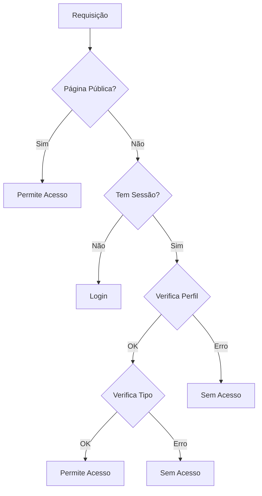
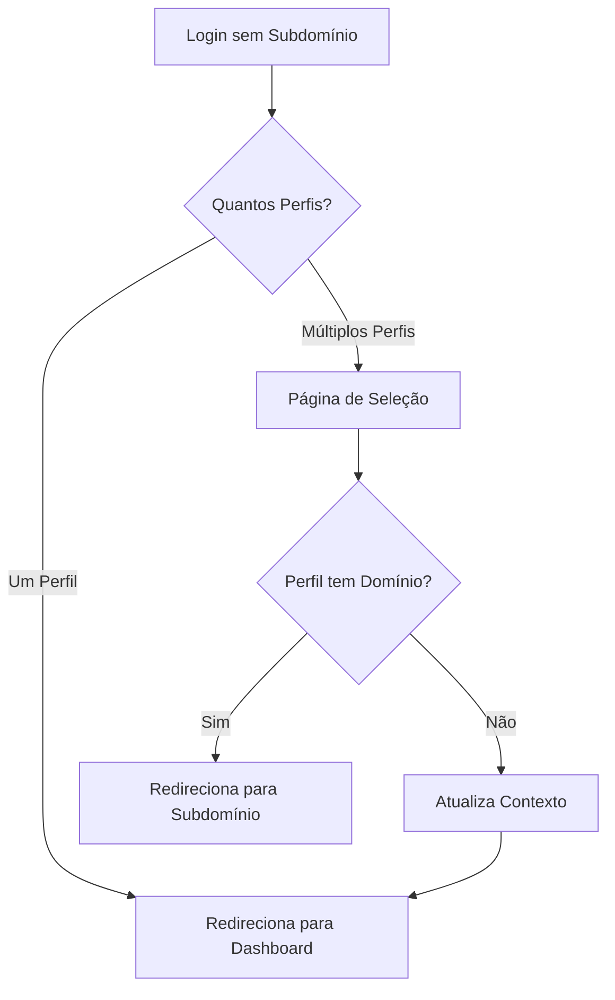

# Sistema de Autenticação e Perfis

## Visão Geral
O sistema utiliza Supabase para autenticação e gerenciamento de perfis. A autenticação é baseada em sessão e os perfis são gerenciados através de tabelas específicas no banco de dados.

## Tipos de Perfis

### Enumeração de Tipos
```typescript
const PERFIL_TIPOS = {
  PESSOA: 1,   // Perfil básico
  REVENDA: 2,  // Perfil de revenda
  ERP: 3,      // Perfil de ERP
  MASTER: 4    // Perfil administrativo
} as const
```

### Status de Revenda
```typescript
const REVENDA_STATUS = {
  PENDENTE: 1,  // Aguardando ativação
  ATIVO: 2,     // Revenda ativa
  SUSPENSO: 3   // Revenda suspensa
} as const
```

## Estrutura de Dados

### Tabela `perfis`
```sql
CREATE TABLE perfis (
  id UUID PRIMARY KEY,
  user_id UUID REFERENCES auth.users,
  tipo INTEGER NOT NULL,
  nome_completo TEXT,
  foto_url TEXT,
  dominio TEXT UNIQUE,
  apelido TEXT,
  revenda_status INTEGER,
  created_at TIMESTAMP WITH TIME ZONE DEFAULT NOW()
);
```

### Tabela `perfis_users`
```sql
CREATE TABLE perfis_users (
  id UUID PRIMARY KEY,
  perfil_id UUID REFERENCES perfis(id),
  user_id UUID REFERENCES auth.users(id),
  created_at TIMESTAMP WITH TIME ZONE DEFAULT NOW()
);
```

## Fluxo de Autenticação

### 1. Login Inicial
- Arquivo: `src/app/auth/login/page.tsx`
- O usuário insere email e senha
- Chamada ao Supabase para autenticação:
```typescript
const { error } = await supabase.auth.signInWithPassword({
  email,
  password,
})
```

### 2. Carregamento do Perfil
- Arquivo: `src/contexts/perfil.tsx`
- Após autenticação, o perfil é carregado baseado no user_id
- O perfil determina o tipo de acesso e as permissões

### 3. Redirecionamento
- Baseado no tipo do perfil:
  - REVENDA → `/revendas`
  - ERP → `/erp/dashboard`
  - MASTER → `/master`
  - Outros → `/auth/sem-acesso`

## Middleware de Proteção
- Arquivo: `src/middleware.ts`
- Protege rotas baseado no tipo de perfil
- Verifica permissões de acesso
- Redireciona usuários não autorizados

### Páginas Públicas
```typescript
const PUBLIC_PAGES = [
  '/auth/login',
  '/auth/logout',
  '/auth/sem-acesso',
  '/auth/usuario-nao-autorizado',
  '/public/inscricao-revenda',
  '/public/inscricao-revenda/sucesso',
  '/public/home'
]
```

### Verificações do Middleware
1. Verifica se é página pública
2. Verifica sessão do usuário
3. Carrega perfil do usuário
4. Verifica tipo de perfil vs rota acessada
5. Verifica status de revenda (se aplicável)
6. Verifica acesso ao perfil do domínio

## Contexto de Perfil
- Arquivo: `src/contexts/perfil.tsx`
- Gerencia estado global do perfil
- Fornece métodos para atualização do perfil
- Interface do contexto:
```typescript
interface PerfilContextType {
  perfil: Perfil | null;
  perfil_user: Perfil | null;
  perfilPublico: PerfilPublico | null;
  isLoading: boolean;
  error: Error | null;
  refreshPerfil: () => Promise<void>;
}
```

## Hook useRevendaStatus
- Arquivo: `src/hooks/useRevendaStatus.ts`
- Gerencia status específico de revendas
- Verifica ativação da revenda
- Gerencia conta Asaas (se necessário)

### Estados de Revenda
1. Pendente (status = 1)
   - Redireciona para `/revendas/ativar_revenda`
2. Ativo (status = 2)
   - Permite acesso normal ao módulo
3. Suspenso (status = 3)
   - Redireciona para página de suspensão

## Fluxo de Redirecionamento

### Login Bem-sucedido
```mermaid
graph TD
    A[Login] --> B{Tipo de Perfil}
    B -->|Revenda| C{Status}
    B -->|ERP| D[/erp/dashboard]
    B -->|Master| E[/master]
    C -->|Pendente| F[/revendas/ativar_revenda]
    C -->|Ativo| G[/revendas]
    C -->|Suspenso| H[/auth/sem-acesso]
```

### Proteção de Rotas


## Autenticação com Subdomínios

### Visão Geral do Sistema de Subdomínios
O sistema suporta múltiplos subdomínios, onde cada subdomínio está associado a um perfil específico. Por exemplo:
- `empresa1.app.com` → Perfil ERP da Empresa 1
- `revenda1.app.com` → Perfil de Revenda 1
- `master.app.com` → Perfil Master

### Estrutura de Dados para Subdomínios
```sql
ALTER TABLE perfis ADD COLUMN dominio TEXT UNIQUE;
CREATE INDEX idx_perfis_dominio ON perfis(dominio);
```

### Fluxo de Autenticação com Subdomínios

#### 1. Detecção de Subdomínio
```typescript
const hostname = window.location.hostname;
const subdomain = hostname.split('.')[0];
```

#### 2. Carregamento do Perfil Público
```typescript
const { data: perfilPublico } = await supabase
  .from('perfis')
  .select('*')
  .eq('dominio', subdomain)
  .single();
```

#### 3. Verificação de Acesso
O acesso a um perfil é permitido em duas situações:
1. O usuário é o proprietário do perfil (`perfil.user_id === session.user.id`)
2. O usuário tem uma entrada na tabela `perfis_users`

```typescript
const checkUserAccess = async (userId: string, perfilId: string) => {
  const { data } = await supabase
    .from('perfis_users')
    .select('*')
    .eq('user_id', userId)
    .eq('perfil_id', perfilId)
    .single();
  
  return !!data;
};
```

### Redirecionamento Baseado em Subdomínio

#### Durante o Login
```typescript
if (perfilSubdominio) {
  // Verifica acesso
  const userHasAccess = perfis.some(p => p.id === perfilSubdominio.id) || 
                      await checkUserAccess(session.user.id, perfilSubdominio.id);

  if (!userHasAccess) {
    throw new Error('Você não tem permissão para acessar este perfil');
  }

  // Redireciona baseado no tipo
  switch (perfilSubdominio.tipo) {
    case PERFIL_TIPOS.REVENDA:
      router.push('/revendas/dashboard');
      break;
    case PERFIL_TIPOS.ERP:
      router.push('/erp/dashboard');
      break;
    case PERFIL_TIPOS.MASTER:
      router.push('/master/dashboard');
      break;
  }
}
```

#### No Contexto de Perfil
```typescript
if (perfilPublicoData) {
  const userHasAccess = perfis.some(p => p.id === perfilPublicoData.id) || 
                      await checkUserAccess(session.user.id, perfilPublicoData.id);
  
  if (userHasAccess) {
    setPerfil(perfilPublicoData);
    setPerfil_user(perfis[0]);
  } else {
    router.push('/auth/sem-acesso');
  }
}
```

### Tratamento de Erros
1. Subdomínio não encontrado
   ```typescript
   if (!perfilSubdominio) {
     throw new Error('Perfil não encontrado para este domínio');
   }
   ```

2. Acesso não autorizado
   ```typescript
   if (!userHasAccess) {
     throw new Error('Você não tem permissão para acessar este perfil');
   }
   ```

3. Tipo de perfil inválido
   ```typescript
   if (!Object.values(PERFIL_TIPOS).includes(perfilSubdominio.tipo)) {
     throw new Error('Tipo de perfil não reconhecido');
   }
   ```

### Considerações de Segurança

1. **Validação de Subdomínio**
   - Sempre validar o formato do subdomínio
   - Evitar caracteres especiais e SQL injection
   - Usar prepared statements nas queries

2. **Verificação de Acesso em Camadas**
   - Middleware verifica acesso inicial
   - Contexto de perfil mantém verificação contínua
   - Componentes fazem verificações específicas

3. **Cache e Performance**
   - Cachear resultados de verificação de acesso
   - Minimizar consultas ao banco de dados
   - Usar índices apropriados nas tabelas

### Logs e Monitoramento

1. **Logs de Acesso**
   ```typescript
   console.log('Tentativa de acesso:', {
     userId: session.user.id,
     subdomain,
     timestamp: new Date(),
     success: userHasAccess
   });
   ```

2. **Logs de Erro**
   ```typescript
   console.error('Erro de acesso:', {
     error,
     userId: session.user.id,
     subdomain,
     timestamp: new Date()
   });
   ```

### Manutenção e Atualizações

1. **Adição de Novo Perfil**
   - Verificar unicidade do domínio
   - Atualizar permissões necessárias
   - Adicionar entradas em `perfis_users` se necessário

2. **Alteração de Domínio**
   - Verificar referências ao domínio antigo
   - Atualizar DNS se necessário
   - Manter redirecionamento temporário

3. **Remoção de Perfil**
   - Remover entradas em `perfis_users`
   - Atualizar cache e sessões ativas
   - Manter histórico de acesso

### Testes Recomendados

1. **Testes de Acesso**
   ```typescript
   it('deve permitir acesso ao proprietário do perfil', async () => {
     // Implementar teste
   });

   it('deve permitir acesso via perfis_users', async () => {
     // Implementar teste
   });

   it('deve negar acesso não autorizado', async () => {
     // Implementar teste
   });
   ```

2. **Testes de Redirecionamento**
   ```typescript
   it('deve redirecionar para dashboard correto', async () => {
     // Implementar teste
   });
   ```

3. **Testes de Erro**
   ```typescript
   it('deve tratar subdomínio inválido', async () => {
     // Implementar teste
   });
   ```

## Fluxo de Login sem Subdomínio

Quando um usuário tenta fazer login sem um subdomínio (ex: `app.com/auth/login`), o sistema segue a seguinte lógica:

1. **Verificação de Subdomínio**
```typescript
const hostname = window.location.hostname
const subdomain = hostname.split('.')[0]
const isLocalhost = hostname === 'localhost' || hostname === '127.0.0.1'

// Verifica se não tem subdomínio ou é localhost
if (isLocalhost || subdomain === hostname) {
  // Lógica para login sem subdomínio
}
```

2. **Verificação de Perfis**
   - Se o usuário tem apenas um perfil:
     - Redireciona diretamente para o dashboard apropriado
   - Se o usuário tem múltiplos perfis:
     - Redireciona para `/auth/selecionar-perfil`

3. **Página de Seleção de Perfil**
   - Exibe todos os perfis disponíveis para o usuário
   - Para cada perfil, mostra:
     - Nome/Apelido
     - Tipo (ERP, Revenda, Master)
     - Logo/Foto (se disponível)
     - Domínio (se existir)

4. **Seleção de Perfil**
   - Se o perfil tem domínio:
     ```typescript
     if (perfil.dominio) {
       const protocol = window.location.protocol
       const domain = window.location.host.split('.').slice(1).join('.')
       window.location.href = `${protocol}//${perfil.dominio}.${domain}/auth/login`
     }
     ```
   - Se não tem domínio:
     - Atualiza o contexto com o perfil selecionado
     - Redireciona para o dashboard apropriado

### Diagrama de Fluxo sem Subdomínio


### Considerações Importantes

1. **Localhost**
   - Em ambiente de desenvolvimento (localhost)
   - Sempre usa a lógica sem subdomínio
   - Útil para testes e desenvolvimento

2. **Múltiplos Perfis**
   - Interface intuitiva para seleção
   - Mostra informações relevantes de cada perfil
   - Facilita a navegação entre perfis

3. **Redirecionamento**
   - Se o perfil tem domínio próprio:
     - Redireciona para o subdomínio
     - Mantém a consistência do acesso
   - Se não tem domínio:
     - Acesso direto via contexto
     - Sem necessidade de redirecionamento

4. **Segurança**
   - Verifica permissões antes de permitir acesso
   - Mantém controle de acesso consistente
   - Previne acesso não autorizado

### Exemplos de Uso

1. **Usuário com Um Perfil**
```typescript
// Login em app.com
if (perfis.length === 1) {
  const perfil = perfis[0]
  switch (perfil.tipo) {
    case PERFIL_TIPOS.REVENDA:
      router.push('/revendas/dashboard')
      break
    // ... outros casos
  }
}
```

2. **Usuário com Múltiplos Perfis**
```typescript
// Redirecionamento para seleção
router.push('/auth/selecionar-perfil')

// Na página de seleção
const handleSelectPerfil = async (perfil) => {
  if (perfil.dominio) {
    // Redireciona para o subdomínio
    window.location.href = `https://${perfil.dominio}.app.com/auth/login`
  } else {
    // Atualiza contexto e redireciona
    await refreshPerfil()
    router.push(`/${getPerfilRoute(perfil.tipo)}/dashboard`)
  }
}
```

### Manutenção

1. **Adição de Novo Tipo de Perfil**
   - Atualizar enum `PERFIL_TIPOS`
   - Adicionar caso no switch de redirecionamento
   - Atualizar interface de seleção

2. **Alterações de Rota**
   - Manter consistência nas rotas de dashboard
   - Atualizar redirecionamentos conforme necessário

3. **Melhorias de UX**
   - Feedback visual durante carregamento
   - Mensagens de erro claras
   - Animações de transição suaves

## Próximos Passos e Melhorias

1. **Cache de Perfis**
   - Implementar cache no lado do cliente
   - Usar Redis para cache distribuído
   - Invalidar cache apropriadamente

2. **Melhorias de UX**
   - Adicionar feedback visual durante verificações
   - Melhorar mensagens de erro
   - Adicionar página de transição

3. **Segurança Adicional**
   - Implementar rate limiting por IP
   - Adicionar autenticação 2FA
   - Melhorar logging de segurança

## Exemplos de Uso

### Verificar Tipo de Perfil
```typescript
if (perfil.tipo === PERFIL_TIPOS.REVENDA) {
  // Lógica específica para revenda
}
```

### Verificar Status de Revenda
```typescript
if (perfil.revenda_status !== REVENDA_STATUS.ATIVO) {
  router.push('/revendas/ativar_revenda')
}
```

### Verificar Acesso a Módulo
```typescript
if (pathname.startsWith('/erp') && userPerfil.tipo !== PERFIL_TIPOS.ERP) {
  return NextResponse.redirect(new URL('/auth/sem-acesso', req.url))
}
```

## Observações Importantes

### Segurança
- Todas as rotas são protegidas por middleware
- Verificações de tipo de perfil são feitas em múltiplas camadas
- Tokens de sessão são gerenciados pelo Supabase

### Performance
- Perfis são cacheados no contexto
- Verificações de status são feitas apenas quando necessário
- Redirecionamentos são feitos no lado do cliente quando possível

### Manutenção
- Alterações em tipos de perfil devem ser refletidas em todas as camadas
- Novos módulos devem seguir o padrão de proteção de rotas
- Mudanças no fluxo de autenticação devem ser documentadas aqui

## ⚠️ PONTOS CRÍTICOS E BOAS PRÁTICAS

### 1. Múltiplos Perfis
- Um usuário pode ter múltiplos perfis
- NUNCA use `.single()` ao buscar perfis do usuário
- Use `.some()` para verificar acesso a perfis específicos
```typescript
// ❌ ERRADO: Pode causar erro PGRST116
const { data: userPerfil } = await supabase
  .from('perfis')
  .select('*')
  .eq('user_id', userId)
  .single()

// ✅ CORRETO: Lida corretamente com múltiplos perfis
const { data: userPerfis } = await supabase
  .from('perfis')
  .select('*')
  .eq('user_id', userId)
```

### 2. Tipos de Perfil
- SEMPRE importe `PERFIL_TIPOS` de '@/types/perfil'
- NUNCA redefina os tipos em outros arquivos
- Use comparação estrita (===) ao comparar tipos
```typescript
// ❌ ERRADO: Redefinir tipos
const PERFIL_TIPOS = { ERP: 3 } // NÃO FAÇA ISSO

// ✅ CORRETO: Importar do arquivo de tipos
import { PERFIL_TIPOS } from '@/types/perfil'
```

### 3. Middleware
- SEMPRE mantenha os logs detalhados
- Verifique o tipo do perfil do subdomínio, não do usuário
- Considere múltiplos perfis nas verificações de acesso
```typescript
// Exemplo de logs necessários
console.log('=== Middleware Debug ===')
console.log('Hostname:', hostname)
console.log('Subdomain:', subdomain)
console.log('User Perfis:', userPerfis)
console.log('Perfil do subdomínio:', perfilData)
console.log('Tipo do perfil:', perfilTipo)
```

## 🔄 Alterações Recentes

### 15/01/2025 - Correção de Bugs no Middleware
1. Corrigido problema com múltiplos perfis
   - Removido uso de `.single()` na busca de perfis
   - Implementada verificação correta de acesso
2. Melhorada lógica de verificação de subdomínio
   - Uso do tipo do perfil do subdomínio
   - Verificação de acesso mais robusta
3. Removida definição duplicada de `PERFIL_TIPOS`
4. Adicionados logs detalhados para debug

## 🚫 NUNCA FAÇA

1. Não redefina `PERFIL_TIPOS` em nenhum arquivo
2. Não use `.single()` ao buscar perfis de usuário
3. Não remova os logs de debug do middleware
4. Não altere a lógica de verificação de subdomínios sem testes completos

## ✅ SEMPRE FAÇA

1. Mantenha os logs detalhados no middleware
2. Teste todos os cenários ao fazer alterações:
   - Login com usuário sem acesso ao subdomínio
   - Login com usuário com acesso ao subdomínio
   - Login com usuário com múltiplos perfis
   - Acesso a todas as rotas protegidas
3. Documente alterações neste arquivo
4. Verifique os logs do middleware ao debugar problemas
